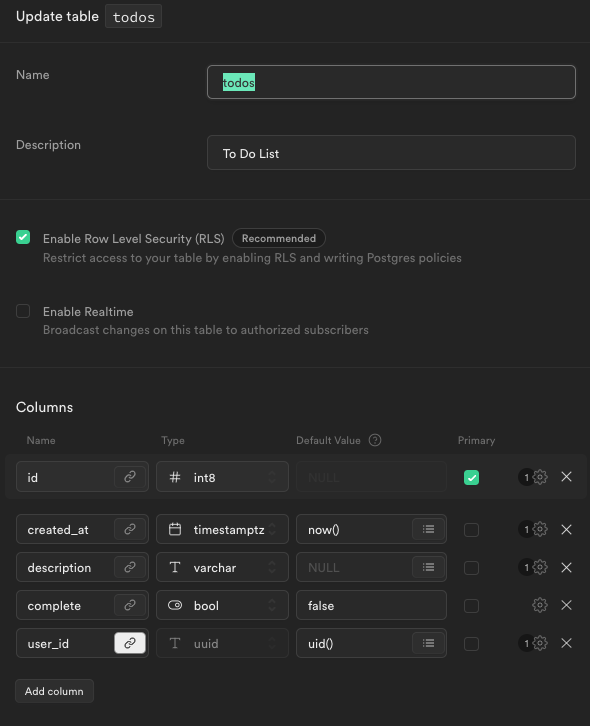

# User Todos Supabase: Single Page CRUD

## The Golden Rule:

🦸 🦸‍♂️ `Stop starting and start finishing.` 🏁

If you work on more than one feature at a time, you are guaranteed to multiply your bugs and your anxiety.

Work incrementally, one small step at a time!

## Demo

Use [this template](https://github.com/alchemycodelab/web-finish-todos-supabase) for this deliverable.

## Live Example:

[Demo](https://web-todos-supabase.netlify.app)

## Requirements

For this deliverable, use the provided supabase database and application code. Auth is already provided.

Your job is to add:

### Part A: Add New User Todo

-   `fetch-utils.js`
    -   `createTodo`
-   `app.js`
    -   imports
    -   `addTodoForm` submit event handler

Because you don't have access to the supabase console for this project,
it will be difficult to validate that the todo has been added until you
implement Part B. Use the network tab and "Payload" subtab for the request
to validate the object you sent to supabase.

### Part B: Get All User Todos

-   `fetch-utils.js`
    -   `completeTodo`
-   `app.js`
    -   imports
    -   `window` load event handler

### Part C: Complete Todo

-   `fetch-utils.js`
    -   `completeTodo`
-   `app.js`
    -   imports
    -   `displayTodos` todoEl
-   `render-utils.js`
    -   `renderTodo`

### Part D: Delete All Users Todo

-   `fetch-utils.js`
    -   `deleteAllTodos`
-   `app.js`
    -   imports
    -   `removeButton` click event handler

## Data Model

Here is the schema for the `todos` table in supabase:

## Rubric

The following is required for your assignment to be graded:

-   PR open from `dev` to `main`
-   PR Passes CI (lint + tests)
-   PR preview on netlify

| Commit with Working Feature... | Points |
| ------------------------------ | -----: |
| Get All Todos                  |      2 |
| Add Todo                       |      2 |
| Complete Todo                  |      2 |
| Edit Todo                      |      2 |
| Delete Todo                    |      2 |
